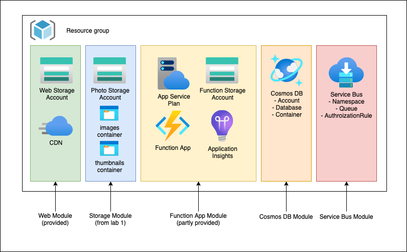

# azure-101-bicep

In this lab we will create the following infrastructure.

## Relevant links

- [Bicep documentation](https://docs.microsoft.com/azure/azure-resource-manager/bicep/)
- [Bicep functions reference](https://docs.microsoft.com/azure/azure-resource-manager/bicep/bicep-functions)
- [Resource reference](https://docs.microsoft.com/azure/templates/)
- `list*` functions ([documentation](https://docs.microsoft.com/azure/azure-resource-manager/bicep/bicep-functions-resource#list))
- `Microsoft.DocumentDB/databaseAccounts/sqlDatabases` ([documentation](https://docs.microsoft.com/azure/templates/microsoft.documentdb/databaseaccounts/sqldatabases?tabs=bicep))
- `Microsoft.DocumentDB/databaseAccounts/sqlDatabases/containers` ([documentation](https://docs.microsoft.com/azure/templates/microsoft.documentdb/databaseaccounts/sqldatabases/containers?tabs=bicep))
- `Microsoft.ServiceBus/namespaces` ([documentation](https://docs.microsoft.com/azure/templates/microsoft.servicebus/namespaces?tabs=bicep))
- `Microsoft.ServiceBus/namespaces/AuthorizationRules` ([documentation](https://docs.microsoft.com/azure/templates/microsoft.servicebus/namespaces/authorizationrules?tabs=bicep))
- `Microsoft.ServiceBus/namespaces/queues` ([documentation](https://docs.microsoft.com/azure/templates/microsoft.servicebus/namespaces/queues?tabs=bicep))